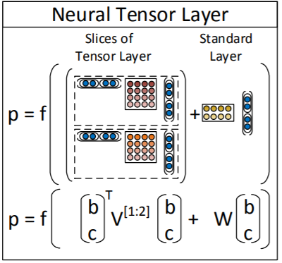
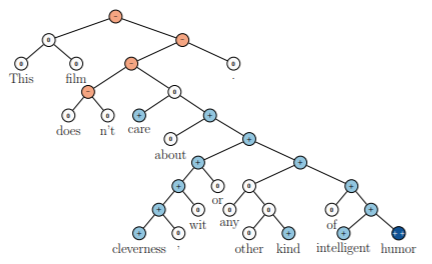

# Recursive Neural Network for Sentiment Analysis with Pytorch

A recursive neural network for sentiment analysis

## Introduction

This project is to implement the sentiment analyser in the paper: Recursive Deep Models for Sentiment Compositionality Over a Sentiment Treebank.
Actually, we can do sentiment analysis using different kinds of structures, like RNN and CNN. The reason why we use Recursive Neural Network is 
that this kind of network take into consideration the syntactic structure of the sentences. On the other hand, Stanford Sentiment Treebank provides 
us with large amount of high quality parsed data to train a Recursive Neural Network.  

The architecture of the network:  
  
The dataset structure:  
  

## Methodology

1. Read sentences from file build tree structures for each sentence
2. Build a recursive neural network model sentiment analysis
3. Train the model with approporiate learning rate
4. Evluate the model with test data
Note: We need to write two recursion, one for parsing string to tree structured data, one for computing vector representation for each phrase.

## Result
Test Acc:  67.19370460048427

## References:
https://nlp.stanford.edu/~socherr/EMNLP2013_RNTN.pdf  
https://nbviewer.jupyter.org/github/DSKSD/DeepNLP-models-Pytorch/blob/master/notebooks/09.Recursive-NN-for-Sentiment-Classification.ipynb  
https://nlp.stanford.edu/sentiment/index.html  
https://github.com/aykutfirat/pyTorchTree  